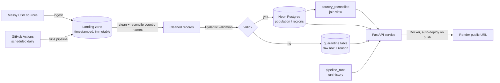

# Cloud-Deployed Data Pipeline

A production-style data pipeline that ingests two messy, mismatched CSV sources,
reconciles them, validates every row, and loads clean data into cloud-hosted
Postgres — with bad rows quarantined (never silently dropped), every run logged,
a FastAPI serving layer, and scheduled unattended execution via GitHub Actions.

**Live API:** https://cloud-data-pipeline-api.onrender.com  ·  **Interactive docs:** https://cloud-data-pipeline-api.onrender.com/docs

## Architecture

## Tech stack
- **Ingestion / processing:** Python, pandas
- **Validation:** Pydantic v2 (row-level; failures routed to quarantine)
- **Storage:** Neon (serverless Postgres)
- **Serving:** FastAPI + uvicorn
- **Orchestration:** GitHub Actions (scheduled + manual)
- **CI/CD:** ruff + pytest on push; Docker image auto-deployed to Render
- **Container:** Docker

## The four stages
1. **Ingest** — raw files copied untouched into a timestamped landing zone with a
   SHA-256 manifest. Fully re-runnable, no side effects.
2. **Clean, validate, load** — whitespace/casing/number cleanup, dedup, and
   reconciliation of differently-spelled country names (`USA` /
   `United States of America` -> `United States`). Valid rows load to Postgres;
   invalid rows land in a `quarantine` table with the failure reason.
3. **Orchestrate & serve** — scheduled GitHub Action runs the pipeline unattended
   with DB retries; every run logged to `pipeline_runs`; FastAPI exposes the data.
4. **Containerize & deploy** — Dockerized API, CI on every push, live on Render.

## Run locally
python -m venv .venv && .venv\Scripts\Activate.ps1 # Windows
pip install -r requirements.txt
python -m src.pipeline # ingest + clean + validate + load + log
uvicorn src.api:app # http://127.0.0.1:8000/docs

`DATABASE_URL` (Neon connection string) goes in a local `.env` — see `.env.example`.

## API endpoints
| Endpoint       | Returns                                        |
|----------------|------------------------------------------------|
| `/health`      | liveness + DB reachability                     |
| `/countries`   | reconciled population + region data            |
| `/population`  | cleaned population rows                         |
| `/quarantine`  | rejected rows and why they failed              |
| `/runs`        | pipeline run history                           |
| `/stats`       | row counts + validation failure rate           |

## Metrics
Measured from the `pipeline_runs` log (queries in `docs/metrics.sql`):
- **Rows per run:** 17 loaded
- **Validation failure rate:** 10.5%
- **Freshness lag:** under 00:26:11.060663 hours (time since last successful run)
- **Success rate:** 100.0% of runs succeeded

## Broken-input demo
Feeding a deliberately broken file routes bad rows to quarantine while clean rows
still load — see `demo.mp4`. This is the core reliability guarantee of the pipeline.

## Run in the cloud
The GitHub Action (`.github/workflows/pipeline.yml`) runs the pipeline daily and
can be triggered manually. It needs a `DATABASE_URL` repository secret.